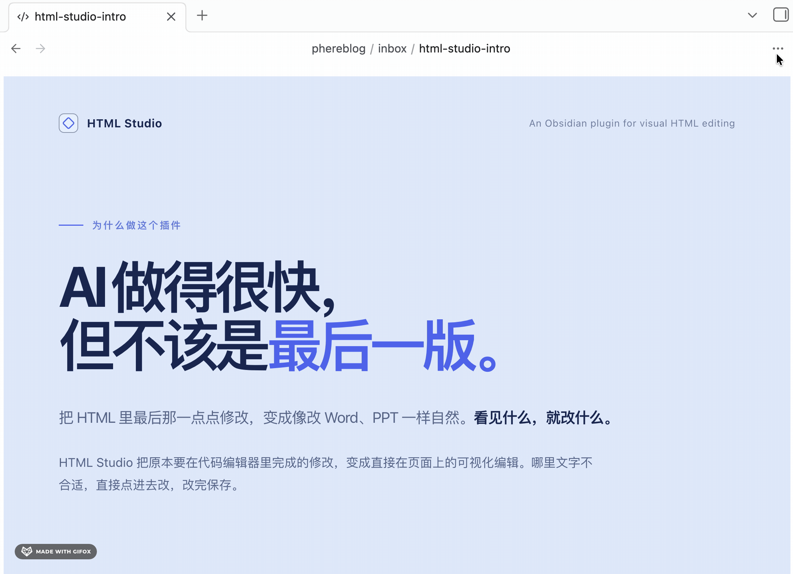

<div align="center">

# HTML Studio

**在 Obsidian 中直接阅读、查看和可视化编辑 HTML 文件。**

[](./LICENSE)
[](https://obsidian.md)
[](../../releases)

[](./README.md)
[](./README.zh-CN.md)

</div>

现在 AI 生成的 HTML 越来越好看了——PPT、报告、仪表盘。但开会前想改个标题，还得回去翻代码。

HTML Studio 让你**直接点上去改**。改完保存，就这么简单。

<div align="center">



</div>

---

## 它有什么不同

- **像改文档一样改网页** —— 点文字直接输入，点图片直接替换。幻灯片和长页面都支持，不管文件怎么写的。
- **保存不会弄坏文件** —— 只合并你改过的部分，脚本和样式原样保留。
- **开箱即安全** —— 沙箱渲染，链接不会随手一点就跳转（也不会触发埋点），想打开用 `⌘/Ctrl + 点击`。

## 功能特性

### 📖 阅读与浏览

在 Obsidian 中直接打开 `.html` / `.htm` / `.mhtml` 文件 —— 渲染呈现，而非原始源码。

- **沙箱渲染** —— 文件在安全 iframe 中显示，提供 5 档安全级别可选（Balance / Low Restricted / Unrestricted / High Restricted / Text-only）。
- **适配各种结构** —— 幻灯片（reveal.js、JMC 书页式分页 HTML……）与纵向滚动长页（报告、简报、仪表盘）均可自动识别并正确渲染。
- **缩放（放大/缩小/重置）**、自定义背景色、**页内搜索**。
- **支持 MHTML** —— 可打开浏览器保存的 `.mht` / `.mhtml` 网页存档。
- **在默认浏览器中打开** —— 一个菜单动作，把文件交给系统浏览器做全保真预览。
- **对上游的 Bug 修复：** `position: fixed` 元素正确悬浮（上游无条件写入 `transform: scale(1)` 会破坏 fixed 定位）。

### ✏️ 可视化编辑

- **点击编辑文字** —— 文件中的所有文本块均可就地编辑：标题、段落、列表项、表格单元格，以及 `div` / `span` 内的文字。通过文本节点遍历器自动标记所有可编辑区域，不受页面标签习惯限制。
- **替换图片** —— 点击任意图片并选择本地文件；图片以 Data URL 内嵌，保存后的文件完全自包含、离线可用。
- **幻灯片式翻页编辑** —— 幻灯片配备悬浮页码条 + `← →` 键盘翻页（7 种选择器策略自动探测，配合真分页启发式判定，纵向长页不会被误判为幻灯片、保持原生滚动）。
- **动态目录导航可编辑**（v2.0.1）—— JS 运行时生成的悬浮目录（由各 slide 的 `data-title` 构建）同样可编辑：点击目录文字直接修改，保存时写回对应 slide。运行时生成的 UI 绝不会写进你的文件。
- **安全保存（母版合并）** —— 保存时重新从磁盘读取原文件作为母版，仅替换编辑过的部分。脚本、样式及其他未编辑内容原样保留——即使预览模式曾剥离它们。

### 🛡 链接安全处理

- 普通点击外部链接不跳转——同时防止误触跟踪/埋点上报。使用 `⌘/Ctrl + 点击` 刻意打开，或在页面菜单中随时开关拦截。

## 使用方法

1. 在仓库中打开任意 `.html` / `.htm` 文件 —— 将以 HTML Studio 视图打开，而非原始文本。
2. **编辑**：打开右上角 `⋮` 菜单 → **编辑此页面**。文字变为可编辑（蓝色聚焦框）；点击图片可替换。幻灯片用 `← →` 或悬浮页码条翻页。
3. **保存**：`⋮` 菜单 → **保存修改**。原文件以母版合并方式重写，运行时脚本保持原样。
4. **链接**：默认拦截；`⌘/Ctrl + 点击` 手动打开，或在 `⋮` 菜单中切换。
5. **浏览器**：`⋮` 菜单 → **在默认浏览器中打开**。

> 提示：对于含丰富交互（你关心的脚本）的页面，编辑和保存前请切换到 *Unrestricted* 模式。

## 安装

### AI 安装（最快）

把下面这段话直接发给你的 AI 助手（Claude Code、Cursor、Copilot、Trae 等），让它替你装好：

```text
帮我安装 Obsidian 插件 "HTML Studio"：
1. 从 https://github.com/pherehouse/obsidian-html-studio/releases/latest 下载 zip
2. 解压后把 html-studio 文件夹放到 <我的仓库>/.obsidian/plugins/ 目录下
3. 告诉我如何在 Obsidian 设置里启用它
```

或者用 curl 一条命令（对 AI 最友好，单个文件）：

```bash
curl -fsSL https://github.com/pherehouse/obsidian-html-studio/releases/latest/download/html-studio.zip -o /tmp/html-studio.zip
unzip -o /tmp/html-studio.zip -d <我的仓库>/.obsidian/plugins/
```

AI 只需下载一个 zip、解压到插件目录——几秒搞定，无需手动下载。

### 从 GitHub 手动安装

1. 从 [最新 release](../../releases) 下载 `html-studio.zip`。
2. 解压到 `<你的仓库>/.obsidian/plugins/` —— 自动生成 `html-studio/` 文件夹。
3. 在 设置 → 第三方插件 中启用 **HTML Studio**。

### BRAT（推荐用于跟踪更新）

将本仓库添加到 [BRAT](https://github.com/TfTHacker/obsidian42-brat)，它会自动跟踪 release 更新。

## 兼容性说明

- 编辑与保存仅限桌面端（使用 Electron 原生对话框 API）。
- 在你显式保存之前，文件绝不会被修改。查看器本身是只读的。

## 致谢与许可

- **本项目**由 [pherehouse](https://github.com/pherehouse) 开发维护。
- **基于** **Nuthrash** 的 [obsidian-html-plugin](https://github.com/nuthrash/obsidian-html-plugin) —— 感谢其扎实的查看器基础、多模式渲染管线和 MHTML 支持。本 Fork 的新增内容：可视化编辑、智能幻灯片识别、母版合并保存、链接拦截、默认浏览器移交，以及 `position:fixed` 修复。
- 感谢 Obsidian 社区的反馈与灵感。

以 [MIT License](LICENSE) 开源，并遵循上游许可协议。
